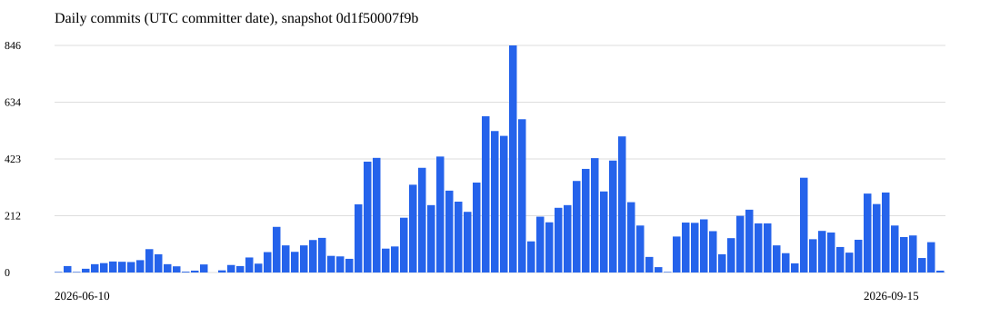
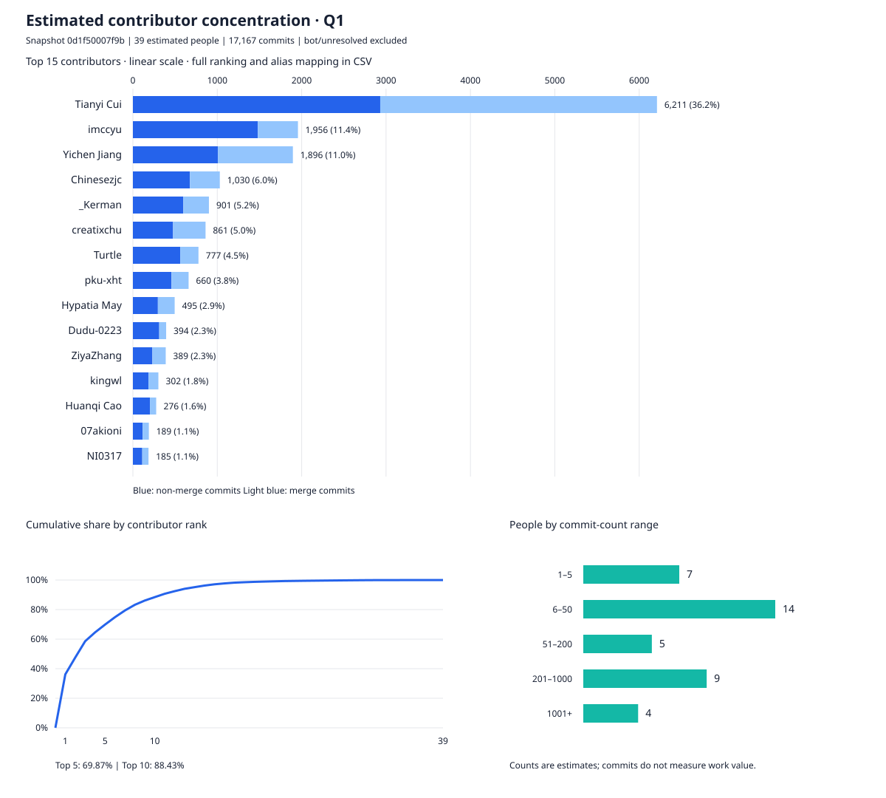
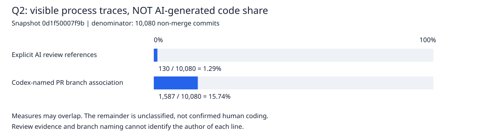

# 问题 1　开发周期、提交频率与团队组成

> 状态：六个问题均已完成证据分析和个人审阅；主要数字、案例、方法局限及小组实践启示已整理，整份报告完成。

> 复核状态：用户重新克隆仓库后，已使用 bash 完整重跑第 1 题分析。仓库 HEAD 与固定快照一致，汇总结果与此前完全一致，7 项计数核对全部通过，分析前后研究仓库工作区均无改动。详见 [复核记录](evidence/q1-reverification.json)。

## 1.1 统计范围与复现方法

研究对象为 deepseek-ai/deepseek-harness。2026-09-16 05:21:41 UTC 首次记录本地分析快照，默认分支为 `master`，固定终点为 `0d1f50007f9bca3f52b06e1c3074fa14d5fb0720`。这里的记录时间是分析时刻，不保证等于远端最后同步时刻；结论仅适用于该快照。

统计覆盖该提交可达的全部历史，包括已经并入历史的分支提交，不包含其他未合入分支。仓库不是浅克隆，`git fsck --connectivity-only --no-dangling` 成功完成。该检查支持对象连通性完整，不证明远端从未删除分支或改写历史。

主时间口径为 **UTC committer 时间**，表示该提交对象被创建或重写的时间，不一定是代码最初编写时间，也不一定是进入主分支的时间。author 时间另外统计，作为敏感性对照。合并按父提交数大于 1 判定；非合并提交仍可能是文档、测试、回退等，不能全部视作新增功能。

在作业根目录使用 bash 复现，无需联网、开启代理或安装研究对象的依赖：

```bash
python3 scripts/analyze_q1.py
git -C deepseek-harness rev-list --count 0d1f50007f9bca3f52b06e1c3074fa14d5fb0720
git -C deepseek-harness rev-list --count --min-parents=2 0d1f50007f9bca3f52b06e1c3074fa14d5fb0720
git -C deepseek-harness rev-list --count --no-merges 0d1f50007f9bca3f52b06e1c3074fa14d5fb0720
```

后三条命令的实际输出依次为 `17177`、`7097`、`10080`。脚本复用已保存的快照，不随当前 HEAD 移动更新统计对象。

证据：[快照](evidence/snapshot.json)、[分析脚本](scripts/analyze_q1.py)、[Git 命令与原始输出](evidence/commands-q1.json)、[完整提交表](evidence/commits.csv)、[汇总与核对结果](evidence/q1-summary.json)。

## 1.2 初步结论：开发持续且存在集中爆发

| 指标 | 实际结果 |
|---|---:|
| 最早 committer 时间 | 2026-06-10 14:58:56 UTC |
| 最晚 committer 时间 | 2026-09-15 03:16:06 UTC |
| 时间跨度 | 96 天 12 小时 17 分 10 秒，约 96.51 天 |
| 首尾日期均计入的日历天数 | 98 |
| 有提交的日期数 | 97 |
| 没有提交的日期 | 2026-06-27 |
| 全部提交 | 17,177 |
| 合并提交 | 7,097，约 41.32% |
| 非合并提交 | 10,080 |
| 每日平均提交数（含无提交日期） | 175.28 |
| 峰值日期 | 2026-07-30：846 条，其中合并 453 条、非合并 393 条 |

根提交 `b67e81ac97647270b3002d78532baf3a5b68cbc3` 的标题是 `Initialize repo with README, AGENTS.md, and CLAUDE.md symlink`，涉及 README、AGENTS.md 等初始化文件。终点提交 `0d1f50007f9bca3f52b06e1c3074fa14d5fb0720` 是 PR #4192 的合并提交。两者原始时间与文件统计见[提交抽查记录](evidence/q1-case-details.txt)。这里测量的是可观察 Git 历史跨度，不能推断团队在根提交之前没有准备工作，也不能把终点当成项目结束。



| 月份 | 全部提交 | 合并 | 非合并 |
|---|---:|---:|---:|
| 2026-06（10—30 日） | 583 | 196 | 387 |
| 2026-07 | 8,086 | 4,061 | 4,025 |
| 2026-08 | 6,323 | 2,117 | 4,206 |
| 2026-09（1—15 日） | 2,185 | 723 | 1,462 |

数据来源：[每日表](evidence/daily.csv)、[每月表](evidence/monthly.csv)。6 月与 9 月不是完整月份，不宜直接以月总量衡量效率。7 月总提交比 8 月多，但非合并提交反而略少，说明合并活动会明显影响“开发频率”的表象。

从日期覆盖率看，活动基本连续；从每日数量看，存在明显集中爆发，尤其是 7 月下旬。峰值不能直接解释为当天编写了最多代码或团队生产率最高。抽查峰值日提交 `6e5a155868053b11e55b0a8e89c7135980362210`，其内容是把 master 合入工作分支；这说明统计还包含分支同步活动，而不只包含主分支接收 PR。峰值日非合并样本 `b46dcb16cbb570c7ff984cdb292481903f04de09` 则是恢复已获评审认可的版本，也不属于新增功能。完整峰值日清单见[峰值日提交表](evidence/peak-day-commits.csv)。

换用 author 日期，峰值仍为 7 月 30 日，但计数变为 889 条；全历史有 1,568 条提交的 author 与 committer UTC 日期不同。因此，“存在集中活动”的判断对这两种口径较稳定，但具体每日数量依赖时间口径。证据见[author 日期统计](evidence/author_daily.csv)。

## 1.3 贡献人数与分布：约 39 名贡献者，开发高度集中

按可能为同一人的署名和账号线索归并，**本报告估计约有 39 名贡献者**。另有 `dependabot[bot]` 的 8 条提交和身份不明的 `Ubuntu` 账号的 2 条提交，单独列出。39 是本报告合并规则下的估计人数，不是经过逐人确认的正式团队编制。

合并采用相同署名、共享邮箱、相同 GitHub 用户名和明确的名称变体。例如，将 imccyu 的三个邮箱记录合为 1 人，将 Ziya/ZiyaZhang 合并，将 kingwl/Wenlu Wang 合并。TianleLin/lintianle、Dudu/Dudu-0223、Turtle 2099 等线索较弱的变体也暂作合并，并在映射表标注为中等置信度。Yif/Yifffan 等缺乏足够关联线索的记录暂时分开；两条署名与其他核心成员邮箱交叉的提交按作者署名归属，避免错误地把两个核心成员合为一人。

原始 76 个“名称＋邮箱”身份仍保存在 [authors.csv](evidence/authors.csv)，每条身份如何归并、理由与置信度均记录在[合并映射表](evidence/author-group-mapping.csv)。合并仅用于本报告统计，没有修改研究仓库的历史或 `.mailmap`。这样既能分析人员分布，也保留调整估计的依据。

### 个人贡献排名与差距

下表按合并后的全部提交量降序排列。占比的分母为归入估计贡献者的 **17,167 条提交**；加上单列的 10 条，仍为原来的 17,177 条。差值表示本行比下一名多出的提交数，第 15 名与完整榜单第 16 名比较。

| 排名 | 估计贡献者 | 全部提交 | 非合并提交 | 占比 | 比下一名多 |
|---|---|---:|---:|---:|---:|
| 1 | Tianyi Cui | 6,211 | 2,931 | 36.18% | 4,255 |
| 2 | imccyu | 1,956 | 1,481 | 11.39% | 60 |
| 3 | Yichen Jiang | 1,896 | 1,009 | 11.04% | 866 |
| 4 | Chinesezjc | 1,030 | 676 | 6.00% | 129 |
| 5 | _Kerman | 901 | 598 | 5.25% | 40 |
| 6 | creatixchu | 861 | 476 | 5.02% | 84 |
| 7 | Turtle | 777 | 561 | 4.53% | 117 |
| 8 | pku-xht | 660 | 457 | 3.84% | 165 |
| 9 | Hypatia May | 495 | 296 | 2.88% | 101 |
| 10 | Dudu-0223 | 394 | 312 | 2.30% | 5 |
| 11 | ZiyaZhang | 389 | 231 | 2.27% | 87 |
| 12 | kingwl | 302 | 185 | 1.76% | 26 |
| 13 | Huanqi Cao | 276 | 202 | 1.61% | 87 |
| 14 | 07akioni | 189 | 115 | 1.10% | 4 |
| 15 | NI0317 | 185 | 111 | 1.08% | 38 |

完整 39 人排名、合并提交数量和累计占比见[合并后贡献表](evidence/contributors-grouped.csv)。



图中上半部分展示前 15 名的提交量，深蓝为非合并提交，浅蓝为合并提交，使用从零开始的线性坐标；左下展示全部 39 名贡献者按贡献量排序后的累计占比；右下展示不同提交量区间对应的人数。

| 每人提交次数 | 估计人数 | 该组提交总数 |
|---|---:|---:|
| 1—5 | 7 | 11 |
| 6—50 | 14 | 295 |
| 51—200 | 5 | 713 |
| 201—1,000 | 9 | 5,055 |
| 1,001 及以上 | 4 | 11,093 |
| 合计 | 39 | 17,167 |

来源：[人数分布表](evidence/contributor-distribution.csv)、[合并统计汇总](evidence/q1-grouped-summary.json)。

### 如何理解开发的集中程度

- 第一名 Tianyi Cui 有 **6,211 条提交，占 36.18%**，比第二名多 **4,255 条**。
- 前 **5 名占 69.87%**，前 **10 名占 88.43%**；累计到第 **8 名**已覆盖约 **83.25%**，说明约五分之一的估计贡献者贡献了超过八成提交。
- 有 **21 名**估计贡献者各自不超过 50 条提交，而只有 **4 名**超过 1,000 条，呈现明显的集中与长尾结构。
- 排除合并提交并重新排名后，前五名仍占估计贡献者非合并提交的 **66.48%**，说明集中现象不仅来自分支整合操作。

因此，项目在提交活动上呈现“少数高频贡献者承担主体贡献、其余贡献者参与较少”的结构。这里的核心与外围是按提交频率描述的角色，不代表正式职务；提交量不等于工作量、代码质量或贡献价值。

原始身份口径的前五占比为 68.69%，合并后的人员估计口径为 69.87%，集中现象在两种方法下均明显。两者分母略有不同：原始口径含机器人与身份不明账号，人员口径单列这 10 条；主要差异来自别名归并。人数估计可以随新线索修订，不影响目前对高度集中的判断。

## 1.4 AI 分析方法可信度与局限

计数来自助手实际执行的 Git 与 Python，未采用背景材料中的描述代替统计。Git 直接计数与解析结果、合并与非合并计数、每日汇总、作者汇总、`shortlog` 总数和身份数共 7 项核对全部通过；根提交、终点、峰值日及两条身份异常提交已抽查。计数的可信度较高，但交叉核对仍依赖同一份 Git 历史，不能独立证明提交元数据真实或未被重写。

合并后的统计额外通过 6 项校验，确保每条原始身份仅映射一次，提交总数、合并/非合并总数和区间汇总保持一致。复现合并统计及图表可运行 `python3 scripts/group_q1_authors.py`；它读取已保存的证据，无需联网。

“活动持续且有爆发”“贡献高度集中”有统计支持；“准确有多少人”“每天实际工作多久”“是否高生产率”“AI 编码占比多少”尚无充分依据。不得用本题的提交速度或长尾分布直接回答第 2 题。

## 1.5 个人判断与小组实践启示

> 本节个人判断依据本人在与 AI 助手讨论时表达的观点整理；统计结果与过程评价分开表述。

在统计方法上，我认为可以合理合并看起来属于同一人的提交，将分析重点放在贡献人数、个人贡献差距和开发集中程度上。后续小组开发中，我们仍应统一 Git 姓名与邮箱，以方便管理和追踪贡献。

对于核心成员贡献高度集中，我总体持积极态度。在 agent 辅助开发的背景下，我认为个人完成工作和学习相关知识的效率得到提升，一个人能够承担更多开发任务。由少数核心成员集中推进开发，有可能减少交流和协调成本，减少不同模块之间因理解不一致而产生的开发冲突，也更容易保持项目整体设计和实现的一致性。因此，我不认为贡献分布必须均匀，集中本身也不一定是问题。

不过，我认为发挥这种集中开发优势的关键，在于能否保证验收和测试的准确性。实现速度提高之后，仍然需要确认功能是否符合需求、不同模块组合后能否正常工作。只有重视这一环节，才能降低项目出错的风险，不能仅凭提交数量多、迭代速度快就认定项目质量可靠。

本题统计显示，前五名估计贡献者占提交总量的 69.87%，排除合并提交后仍占 66.48%，支持“贡献高度集中”的结论。至于集中是否实际降低了该项目的沟通成本、模块冲突，或提高了质量，单凭本题提交统计还不能证实；上述积极评价是我对 agent 辅助开发过程的理解，不是本题已经验证的因果关系。

对后续小组开发，我希望将统一 Git 身份和重视验收、测试作为过程管理的重点：可以接受核心成员承担较多实现工作，同时把功能验收和测试结果作为判断项目完成情况的重要依据。

# 问题 2　AI-coding 的大致密度

## 2.1 初步结论与量化口径

**综合判断：这是一个 AI 参与密度较高、以 coding agent 承担实现工作为主要方式的项目，同时存在评审和人工把关。** 这一判断主要依据项目自身的明确说明，并由具体评审记录和工具命名分支的广泛出现支持；不能仅由第一问的高提交频率或贡献集中推导出来。

对“大致密度”，本次能可靠量化的是**可观察的开发过程痕迹**：固定快照中，**15.74% 的非合并提交关联到 `codex/` 命名的 PR 来源分支**；**1.29% 的非合并提交明确提及 Codex/Claude 评审**。它们均不是“AI 生成代码行占比”。项目自述支持“实现主要依靠 agent”的判断，但现有证据不足以回答“究竟有百分之多少代码由 AI 生成”，也不能说明开发全过程无人参与。

沿用第一问的快照 `0d1f50007f9bca3f52b06e1c3074fa14d5fb0720`，全历史共 17,177 条提交。过程比例以其中 **10,080 条非合并提交**为分母，避免把单纯合并操作直接计作一次编码。

| 指标 | 实际统计 | 如何解释 |
|---|---:|---|
| 含 Codex 关键词的提交 | 2,053 / 17,177 | 仅作检索入口，包含产品功能与分支名，不作为 AI 编码量 |
| 符合指定规则的已知 AI 署名/生成标记 | 0 | 没有检出不等于没有使用 AI，署名规则也不是强制标准 |
| 含 `Co-authored-by` 的提交 | 10 | 不能全视为 AI；其中有 Codesmith bot 署名，但未确认其是否为生成式 AI |
| 评审关键词候选 | 171 | 排除 32 条合并上下文及 9 条产品对象/语义不明记录 |
| 明确提及 AI 评审的非合并提交 | **130 / 10,080 = 1.29%** | 表示记录了 AI 评审参与，不表示 AI 写出了实现 |
| `codex/` 来源分支的 PR 合并 | 237 / 1,514 | 分母仅为可见历史中符合标准标题格式的 PR 合并提交，不是所有 GitHub PR |
| 上述分支关联的非合并提交，去重后 | **1,587 / 10,080 = 15.74%** | 与该类分支有关的提交比例；不代表至少这些代码由 AI 编写 |

已知 AI 署名规则检查 `Co-authored-by` 中的 Claude/Codex/ChatGPT/Copilot，以及行首 `Generated/Written/Implemented by/with ...` 等指定格式；精确正则和统计结果见[汇总](evidence/q2/summary.json)。没有纳入这些规则的其他工具、格式可能被漏检。



两项过程比例可能重叠，不能相加；剩余提交也不能归类为“纯人工编码”。

## 2.2 直接证据与反例

**项目自述。** 固定快照的 `.agents/notes/implemented/process/2026-06-11-quality-gates.md` 写道：

> This codebase is developed primarily by coding agents.

即“这个代码库主要由 coding agents 开发”。同一文档解释，机械可执行的质量门禁比单纯文字约定更适合约束 agent，并提到未经过类型检查的测试曾在评审时才被发现。另一份 `2026-07-19-web-styling-system.md` 说明界面样式由 agent 编写并接受评审。完整固定版本文本和路径历史保存在[项目说明证据](evidence/q2/project-statements.txt)。这是项目方对开发方式的直接描述，证据强于仅凭文风判断，但它不是逐行测量结果；文件名日期也不等于其中所有文字都在该日期写入。

**AI 评审的具体作用。** 提交 `43d81b67cef2a957afd2cb0646894757f3f28315` 明确说明，Codex 评审发现 LSP 的环境变量处理存在类似缺陷。改动涉及 `packages/lsp/lsp-local/src/connection.ts`、共享处理逻辑和相关测试。这说明 AI 在开发过程中参与发现问题；实现者是否为 AI 仍不能仅从这条评审说明确定。

**人工把关并未消失。** 提交 `b46dcb16cbb570c7ff984cdb292481903f04de09` 说明，在人类评审者批准某一版本之后，又出现了未被人类要求的 bot-review 轮次，因此恢复到已获批准的版本。这是自动化活动仍需要人类控制范围的案例；该条中的 bot 不足以单独证明具体模型身份，也不能据此评价所有自动评审的质量。

**关键词误判反例。** 提交 `ace0c4619e34b2af7213b29a4a9dc085b86cf928` 的标题是升级 Codex 和 Claude Code 运行时，涉及项目依赖和后端支持。这里 Codex/Claude 是被开发产品的组成部分，不是对本次代码作者的声明。另一个提交 `ac36c6b9753919d9691b39b5d784c4a523e4addc` 带有 Codesmith bot 的协作者署名，可以视作自动化协作线索，但不能仅凭 `bot` 推断为大模型生成。

以上完整提交信息、哈希和文件变更统计见[定向案例](evidence/q2/targeted-cases.txt)。171 条评审候选的命中行、分类和排除理由见[评审分类表](evidence/q2/review-candidates.csv)；全部协作者署名见[署名表](evidence/q2/coauthor-trailers.csv)。

## 2.3 怎样检查这些 AI 参与线索？

这一节只回答两个问题：带有 Codex 名称的分支涉及多少提交？实际改动是否能证明代码由 AI 编写？

**先追踪分支，统计线索。** 例如，一个分支叫 `codex/修复某功能`，我们找出它合并时带入的新提交，去掉重复记录和合并操作本身。汇总得到 **1,587 条，占非合并提交的 15.74%**。这说明这些提交与 Codex 命名的分支有关，但人也可以创建这样的分支，所以不能直接当成 AI 编码量。

**再抽查改动，检查是否误判。** 我们从四个月的功能开发、缺陷修复和其他改动中，各抽 5 条，共 **60 条**，查看提交说明和部分代码差异。样本中既有“根据 Codex 评审修复问题”，也有“修改产品中的 Codex 支持功能”，还有普通脚本生成的文档更新。这些情况说明：**提到 AI、由工具生成、由 AI 编写，是不同的事情。**

抽查帮助我们发现误判风险，没有测出实际 AI 编码比例。它也不是对全部代码的逐行审计。具体算法、抽样参数和证据链接放在[第二问方法说明](evidence/q2/README.md)，正文不再展开计算步骤。

## 2.4 AI 分析可信度与复现

复现命令为 `python3 scripts/analyze_q2.py`，使用 bash、Git 和 Python 标准库，无需联网或运行研究项目。脚本固定读取第一问快照，重新提取提交消息、分类评审候选、计算分支关联并抽样。见[脚本](scripts/analyze_q2.py)及[命令参数记录](evidence/q2/commands.json)。

助手使用 Git 的直接计数核对了提交总数，并用另一条 Git 命令抽查分支带入的提交是否一致，也检查了抽样是否重复。这些检查支持统计结果可复现，但不能保证所有 AI 行为都被识别：关键词可能漏检，分支名称不保证实际使用了工具，项目说明也可能由 AI 起草，不能自动视为独立的人类证明。因此，项目自述与具体案例支持“AI 广泛参与”的判断，但不足以确定实际生成比例。

还要区分 AI 参与了哪一步：AI 只做评审，与 AI 直接编写代码，不能算成同一回事；AI 起草后又由人修改的代码，也需要事先约定如何计数。本次没有逐次开发会话和编辑来源记录，因此只能判断参与方式和可见痕迹，不能测出实际生成比例。

## 2.5 个人判断与小组实践启示

> 以下个人判断依据本人在与 AI 助手讨论时表达并确认的观点整理；关于来源标记的内容是未来设想，不是本次已验证的技术方案。

我认为，本次分析说明，仅凭代码风格和普通 Git 提交历史，很难建立统一、准确的 AI 编码识别方法。AI 可以模仿人类的编码方式，人和 AI 也都会遵循项目规范；代码还可能经过人工修改或多人协作。因此，只看最终代码，很难分清哪些内容由谁完成。

现阶段，我们主要依赖 commit message、项目文档和工具使用痕迹辅助判断。但这些文字也可能由 AI 起草，不能把它们都当作人类作出的可靠声明。我接受“这个项目 AI 参与程度较高、实现以 coding agent 为主”的判断，因为项目说明和具体记录提供了支持；同时也认可，现有证据不足以给出准确的 AI 生成代码百分比。

未来如果能在 AI 生成内容时就绑定来源标签，并在后续修改中保留对应记录，来源判断可能更可靠。我想到的一种方向是使用区块链等机制保存这类记录。不过，记录不易被篡改，不等于最初的声明就一定真实；关键仍是生成工具能否可靠地记录内容来源，以及修改后还能否追踪。没有来源标签的代码，也不能反过来认定为人工编写。

助手据此提出的小组实践建议是：可以先在 PR 中简要说明 AI 参与了实现、评审还是测试，并保留关键验收依据。这种记录虽然不能精确测量每行代码的来源，但有助于理解协作过程；最终仍需要人类对验收结果负责，与第一问重视验收和测试的判断一致。

# 问题 3　提交代码是否有冲突与合并的动作

## 3.1 结论：有大量合并，也有明确的冲突处理痕迹

**两者都有。** 同一固定快照的 17,177 条提交中，有 **7,097 条合并提交，占 41.32%**。其中 **1,536 条提交消息保留了 `Conflicts:` 清单**；具体案例还记录了解决文档冲突、恢复冲突处理中被截断的代码，以及清理残留冲突标记。

这些证据足以回答“是否发生过”，但不能得出“总共发生了多少次冲突”或“每次都正确解决”。合并可以没有冲突；没有冲突清单的提交，也不一定没有经历冲突。

## 3.2 团队怎样合并分支？

本题按父提交数识别合并：普通提交通常只有一个父提交，合并提交则连接两条或更多历史。本仓库的 7,097 条合并均有两个父提交。再按标题格式分类：

| 合并标题形式 | 数量 | 能看出的动作 |
|---|---:|---|
| `Merge pull request #…` | 1,514 | 通过 PR 汇入分支 |
| `Merge remote-tracking branch …` | 2,763 | 合入本地记录的远端分支历史，例如同步 `origin/master` |
| `Merge branch …` | 1,693 | 合入本地分支历史 |
| `Merge commit …` | 166 | 标题以具体提交标识合入来源 |
| 其他标题 | 961 | 包括自定义的同步主线、合并功能等说明 |
| **合计** | **7,097** | **与第一问合并总数一致** |

表中是标题类别，不是五种完全不同的 Git 合并算法。尤其不能把 7,097 次合并都理解成“向主分支提交了 7,097 个功能”：功能分支在开发期间也会同步主线或合入别的分支，这些历史最后一起进入统计范围。

换一个视角，**从快照沿每次提交的第一个父提交向前追踪**，只保留这条主线视角上的合并，得到 **1,455 条，其中 1,453 条采用 PR 合并标题**。这支持“主线经常通过 PR 集成，而完整历史还包含大量分支内合并”的判断。第一父链是历史结构上的观察口径，不保证历史分支名称始终不变。

例如，快照提交 `0d1f50007f9bca3f52b06e1c3074fa14d5fb0720` 合并 PR #4192，将 `worktree-bootfast2` 的四条提交汇入原主线。这四条涉及启动时延迟加载和按需生成等改动。其父子关系可以直接从[分支图](evidence/q3/branch-graph.txt)查看，不依赖仅凭标题猜测。

完整计数见[分类表](evidence/q3/merge-types.csv)和[合并明细](evidence/q3/merges.csv)。

## 3.3 冲突处理的具体证据

**案例一：同步主线时，记录了冲突文件，并整合两边配置。**

提交 `1b7b50bbe141cfd4d74fad9a4967e24d81812364` 将 `origin/master` 合入 `worktree/web-sidebar-terminal`。消息保留了 `Conflicts:` 清单，涉及 `apps/web/package.json`、`pnpm-lock.yaml`、代码、测试与文档等。

我们对比了 `apps/web/package.json` 的合并结果与两个父版本：结果保留了功能分支已有的 `dsh-subprocess-local` 依赖，同时纳入另一侧的版本更新和 `dsh-experimental-auto-review` 等依赖。对于这个文件，结果体现了两侧内容的整合；不能简单理解为直接用某一边覆盖另一边。原始消息及两份差异见[案例证据](evidence/q3/case-1b7b50bbe1.txt)。这些差异展示最终结果，不能逐行划定哪些改动由自动合并完成、哪些由人或 agent 决定。

另一条合并 `a38c302e4a8e5b1375f7339093893aee1c66a337` 直接写明“Merge master and resolve revert documentation conflicts”，即合并主线并解决回退文档的冲突。这是[明确的处理声明](evidence/q3/case-a38c302e4a.txt)，也说明冲突不限于程序源码。

**案例二：冲突处理之后，仍可能需要补救。**

提交 `eba45d9add924ab00d5e356f436bc9b128a267f1` 说明，处理迁移 API 变更时留下了截断的实现，因此恢复完整 replay 插件。实际 diff 在 `packages/test-support/llm-replay/src/index.ts` 末尾补回 169 行，包含 `installLlmReplay`、配置校验与 `apply` 等内容，与说明相符。见[修复证据](evidence/q3/case-eba45d9add.txt)。消息声称相关测试通过，本次未运行测试或独立核对当时的运行记录。

提交 `e8e0ec417631a91f0365225767bd2df7c3fb79f8` 则在 `packages/test-support/session-snapshot/src/normalize.ts` 的注释里，删除了残留的 `||||||| parent of …` 冲突标记及重复说明。我们直接核对父版本和修复版本，确认这条标记此前存在、随后被移除，见[完整 diff](evidence/q3/case-e8e0ec4176.txt)。这是比关键词更具体的冲突残留证据；它位于注释中，不能据此认定曾导致程序运行失败。

这两个修复提醒我们：**Git 允许提交合并结果，不代表功能与内容已经正确。** 结束冲突处理之后，仍需要检查是否遗漏代码、配置是否兼容，以及行为是否符合预期。

## 3.4 统计局限与 AI 分析可信度

助手用脚本提取父提交、分类标题，再定向检查三条合并和两条修复。总数和合并数等已通过七项核对；复现命令为 `python3 scripts/analyze_q3.py`，具体方法见[第三问证据索引](evidence/q3/README.md)。研究仓库工作区状态前后一致，无需联网或安装研究项目依赖。

本题的证据强弱可以分开看：父提交结构直接证明合并存在；`Conflicts:` 和解决冲突的消息是提交者留下的过程记录；具体 diff 能进一步验证最终改动。我们检出了 1,536 条带冲突清单标题的消息，但没有逐条重演合并，因此这个数字只是**指定格式的记录数量**。宽泛搜索 `conflict` 或“冲突”得到的 1,668 条候选还包含其他语义，不能作为冲突次数。

此外，快进合并可能不创建新的合并提交；squash 会压缩分支提交；rebase 会重写提交。这些操作不能仅靠双父提交统计完整还原。`fix(rebase)` 案例支持存在相关处理记录，但不足以量化 rebase 的频率。当前可见历史也无法展示已经删除或改写掉的全部过程。

案例是为展示不同现象而挑选的，不是随机抽样，因此不能推算“多少比例的合并处理错误”，也不能据此判断问题由人类还是 AI 引入。

## 3.5 个人判断：分支操作不难，难在协作与整合

> 本节依据本人在与 AI 助手讨论时表达的观点整理；小组约定是结合案例形成的实践建议，不是对研究仓库现行制度的断言。

我认为，分支开发有“说简单也简单，说复杂也复杂”的特点。简单之处在于，可以创建一个功能分支，完成开发后再合入主线；复杂之处在于，多个分支可能同时开发，如果任务边界和合并过程不规范，就可能产生冲突或功能问题，合入后还可能需要回退。

本仓库的记录让这种复杂性变得具体：功能分支需要同步主线，冲突会涉及依赖配置、代码、测试和文档；处理之后还出现过恢复截断实现、清理冲突残留的修复。因此，我认为管理重点不能只放在“能否合并成功”，还应关注双方意图是否保留、整合后是否正常，以及出问题时是否能追踪和撤回。这与第一问强调验收和测试准确性的判断一致。这里的案例不能用于比较集中与分散团队的冲突率。

## 3.6 后续小组开发的合并约定

结合本仓库的配置整合、代码截断修复和冲突残留清理案例，小组可以先采用“按任务开分支 → 提交 PR → 审核与测试 → 合入主线”的流程，并遵守以下约定：

1. **一个分支、一个 PR 对应一个明确任务。** 控制改动范围，避免夹带无关重构；同时修改公共接口、依赖或配置时，提前协调影响范围和合入顺序。
2. **及时同步主线，统一合并方式。** 在任务形成可验收的小阶段后及时提交 PR，减少长期分叉。小组可约定按任务 squash 合入，便于追踪功能和定位回退范围；不随意改写共享分支历史，新任务从最新主线创建分支。
3. **先审核，再合入。** PR 说明目的、主要改动和实际验证结果，至少由另一位成员审核。处理冲突时核对双方意图，重要取舍写入 PR；审核后的新增修改也需要复核。
4. **验收最终整合结果。** 冲突处理后重新检查受影响功能并执行相关测试，不能只凭合并成功就判断功能正确。公共接口或复杂冲突由另一位成员重点复核；使用 agent 处理时，成员仍需确认其取舍与验证结果。
5. **修复和回退都保留记录。** 出现问题时，根据影响范围决定局部修复还是撤回任务，说明原因、范围及验证结果。回退前检查后续功能的依赖，回退后再次测试，避免修复一个问题又引入另一个问题。

这些约定是结合本题证据形成的小组实践建议，不代表研究仓库已经采用相同制度。其重点是让每次合并有明确范围、有人审核、有验证依据，并在出现问题时能够追踪和处理。

# 问题 4　你认为其中的文档是给人读的，还是给 agent 读的？

## 4.1 结论：人和 agent 共享文档，按用途明确维护范围

**这个项目的文档不是统一写给某一方，而是按用途分层：使用入口主要服务人类，开发指令明确服务 coding agent，设计理由与技术约定则由双方共享。** 如果聚焦开发过程，文档已不只是给人阅读的附属说明，也承担了向 agent 提供约束与上下文的作用；但这不意味着全仓库文档主要都是提示词。

这里区分的是用途和重点，不是人和 agent 之间不可跨越的阅读界限。同一份自然语言资料可以由双方共同编写和使用；对后续小组实践，更重要的是决定维护哪些资料、每份资料负责什么，以及哪些文字属于产品功能。

判断依据是文件明确说明的对象、内容要求读者完成的任务，以及文本在程序中如何被使用。本次沿用固定快照，定向检查十个文件和两条提交，不按文件数量、字数或目录名称推算读者比例。

## 4.2 文档案例：看用途，而不只看名称

| 案例 | 主要读者判断 | 内容与用途依据 |
|---|---|---|
| 根 `README.md` 与 `docs/user/guide/index.md` | 人类用户为主 | README 提供启动入口、社区和开发导航；用户指南按界面操作顺序指导配置模型、选择工作区、运行任务 |
| `CONTRIBUTING.md` | 人类社区参与者为主 | 说明反馈、插件和社区交流等参与途径；这里仅观察固定快照中的内容，不代表当前远端政策 |
| 根 `AGENTS.md` | 开发 agent 为主，人类维护者也会使用 | 指定改代码前阅读的资料、开发约束及验证要求；README 明确将 agents 引向此文件 |
| `docs/AGENTS.md` | 开发 agent 与维护者共享 | 明确将人类文档分为教程和参考资料，同时将根 AGENTS 定义为 agent 每次会话需要的常驻规则 |
| `.agents/notes/README.md` 及文档分层决策笔记 | 人与开发 agent 共享 | 记录问题、决策、替代方案与后果，帮助后续参与者理解为什么采用某种设计 |
| `packages/core/system-prompt/README.md` | 维护者、集成者与开发 agent 共享 | 解释提示词组件的配置、接口和限制；虽然介绍模型体验，也含提示词示例，但不是整篇直接发给模型的指令 |

这些判断并非仅凭文件名：根 README 写有 “For agents, follow AGENTS.md”，直接区分入口；文档标准又明确写出其结构规则适用于 “human-facing documentation”。两者相互支持，说明项目有意识地区分读者和资料用途。原文见[README](evidence/q4/root-readme.txt)、[用户指南](evidence/q4/user-guide.txt)和[文档标准](evidence/q4/doc-standard.txt)。

Agent Notes 则不能因为放在 `.agents/` 就被认定为只给 AI 阅读。其说明要求保留替代方案和取舍，避免后续反复争论同一个决定。具体的文档分层笔记解释了重复说明、资料过时等问题，以及为何引入文档分类和字数预算。这些理由既帮助 agent 接续工作，也帮助人类评审与维护。见[笔记规则](evidence/q4/notes-guide.txt)和[决策案例](evidence/q4/doc-decision.txt)。笔记中声称规则由检查工具约束，本题没有运行这些工具，也没有验证所有文档均符合规则。

## 4.3 提交信息、代码注释与真正的提示词

**提交信息主要保存改动的解释与追踪线索，人和 agent 都能使用。** 提交 `43d81b67cef2a957afd2cb0646894757f3f28315` 说明评审发现的环境变量缺陷、受影响模块、修复方式及验证线索；`e8e0ec417631a91f0365225767bd2df7c3fb79f8` 则说明删除冲突残留的范围，并声称相关检查通过。这类“问题—改动—验证”的文字方便评审者和后续维护者，也可以成为 agent 读取历史时的上下文。它们不是仅因提到 Codex 就成为模型指令，提交文字也不能证明作者身份或测试实际执行情况。见[提交消息原文](evidence/q4/commit-messages.txt)。

**同一个代码文件中，注释与字符串也可能面对不同读者。** `packages/goal/goal-round-driver/src/prompt.ts` 的 JSDoc 解释函数参数、返回内容与使用位置，主要帮助维护者及开发 agent 理解接口；函数内的字符串则要求模型继续推进目标、核查实际状态、完成前收集证据，属于运行时指令。

这里不只依据语气判断：调用方先执行 `renderGoalRoundPrompt(goal, round)`，再将内容封装成消息，最后调用 `agent.followup(message)`。因此，这段字符串存在直接进入 agent 后续消息的代码路径。见[带行号的注释和提示词](evidence/q4/goal-prompt.txt)及[调用方第 174—192 行](evidence/q4/goal-caller.txt)。本题核查的是静态调用路径，没有运行会话或验证每次运行都触发它。

还需要区分两种 agent：`AGENTS.md` 面向参与开发这个仓库的 coding agent；上述提示词则面向产品运行期间执行任务的 agent。前者是开发协作规范，后者是产品行为的一部分，不应混为同一种“文档”。

## 4.4 AI 分析可信度与局限

本题使用 `git show <固定快照>:<路径>` 提取原文，保存原路径和行号，再根据明确声明、内容用途和调用位置判断读者。复现命令为 `python3 scripts/analyze_q4.py`；证据索引见 [evidence/q4/README.md](evidence/q4/README.md)。五项检查通过，覆盖选中文件数量、明确的 agent 入口、人类文档声明、提示词调用链关键语句以及研究工作区状态前后一致；两条提交也已确认属于快照可达历史。

这些检查能支持证据可追溯，但不能自动验证读者分类正确。样本是定向选择，不能据此量化全仓库“给人读”或“给 agent 读”的比例；缺少实际阅读与上下文加载记录，也无法证明每份文档被谁读取过。因此，正文判断的是**设计用途和预期读者**，而非实际阅读行为。

命令式语气、结构化段落、英文写作或双语版本都只能辅助判断。人类规范也会使用命令句，agent 也能阅读教程；介绍 AI 的文档不一定给 AI 读，由 AI 起草的文档也可能主要服务人类。明确用途比文风更可靠。

## 4.5 个人判断与小组实践启示

> 以下个人判断依据本人使用 agent 的经历及本题讨论整理；共同编写的认识来自个人经验，不是对研究仓库全部文档作者来源的核验。

结合自己的使用经历，我认为技术文档虽然可以按用途服务不同读者，但其内容大多是自然语言，人类和 agent 之间并不存在必须将资料隔离的阅读界限。在我目前使用 agent 的开发过程中，文档基本都是由人类和 agent 共同编写、讨论和制定的。因此，“主要面向谁”可以帮助明确写作方式，却不必成为两套重复文档的划分依据。本题没有逐份核验作者来源，不能据此断言研究仓库的所有文档均由双方共同编写。

我更关注的是应该维护哪些文档，以及各自的内容范围。文档过少、组织不足时，信息容易挤在少数长文档中，或散落在对话和提交记录里，难以检索；文档过多时，又可能出现重复内容、职责不清和更新不同步。关键不在数量多少，而是需要的信息能否找到、同一事实应该在哪里维护。本仓库关于重复说明、资料过时和“一条事实一个主要位置”的记录，正好支持这一关注点；字数限制可以辅助控制膨胀，但不能代替内容组织。

此外，使用 agent 开发 agent 时，需要明显区分两类文字：一类约束参与开发的 agent，例如编码、分支、审核与测试规范；另一类是 agent 产品自身的功能，例如运行时发送给模型的提示词。它们都可能用自然语言表达，但修改前者是在调整开发过程，修改后者则可能改变产品行为。第四问的 AGENTS 与目标续轮提示词案例展示了这种区别。

结合这些判断，小组可以采用以下文档约定：

- **按需要确定维护范围。** README 提供启动方法和资料导航；协作规范集中记录分支、PR 审核与测试要求；重要设计才记录理由和取舍，接口说明与代码注释跟随实现维护，避免为每个小改动新建文档。
- **同一事实有一个主要维护位置。** 人和 agent 共用规范，其他入口通过链接引用。资料难以检索时调整分类和导航，发现重复时合并内容并修复引用，不单纯追求更多或更少的文件。
- **区分开发规范与产品提示词。** 在用途和存放位置上明确标识，避免把产品中的指令当作开发规则。产品提示词的修改纳入功能评审及行为验证。
- **代码与相关文档一起审核。** PR 检查哪些说明需要更新、哪些旧内容已经失效，避免人和 agent 在后续工作中依据不同版本作出判断。

# 问题 5　是否能看出需求、设计、开发、测试的过程

## 5.1 结论：各类活动可见，但不是清晰分开的四段历史

**能看到需求描述、设计取舍、实现和测试，而且存在根据评审与后续问题继续修正的过程。** 不过，它们经常在同一次提交中一起出现，不能据此认定团队严格按“先需求、再设计、再编码、最后测试”的顺序工作，也不能认定采用了测试驱动开发。

本题沿用固定快照，选择“目标自动续轮”功能和“环境变量传递”修复两条线索。重点看需求如何落实为代码与可检查的行为，并区分明确记录、合理推断和缺失信息。

## 5.2 功能线索：让 agent 在同一会话继续推进目标

功能提交 `25555c9cfc33b0e7eb0d656cb3ae011d6e7bfdab` 同时加入设计说明、实现和测试。读取的是该提交当时的版本，见[初始设计说明](evidence/q5/goal-design-at-introduction.txt)与[实现及测试差异](evidence/q5/goal-initial.txt)。

| 活动 | 实际证据 | 能得出的判断 |
|---|---|---|
| 需求 | 设计说明的 Problem 指出，保存目标还不够，需要决定何时开始下一轮，并处理人类输入、取消、目标修改与持久化失败 | 有明确问题和行为约束；没有找到或查证提出这些需求的原始对话 |
| 设计 | 决定通过独立插件连接目标服务与 agent，而不把目标专用逻辑写入核心循环；同一 agent 最多保留一个待执行自动轮次 | 有架构选择、状态规则和替代方案，不只是功能口号 |
| 实现 | 新增 `packages/goal/goal-session/src/index.ts`、`outcome.ts`、`prompt.ts`，分别处理调度、结果及续轮消息等 | 设计有对应代码，而不是仅有计划文档 |
| 测试 | `goal-session.spec.ts` 检查轮次数上限、取消、目标修改和人类输入等情况；`goal-session.e2e.ts` 使用脚本化模型驱动组合场景 | 测试包含关键正常与异常行为；存在测试源码不代表已证明当时执行通过 |

其中的组合测试不只检查函数返回值：它启动子进程，读取会话日志，断言只生成一个会话日志、出现两条自动目标轮次消息、轮次编号为 1 和 2，并检查最终目标完成。这样将“在同一会话连续推进两轮”的需求转化为可观察的断言。模型响应是脚本化的，因此它验证的是程序组合与记录行为，不证明真实模型面对任意目标都能正确完成任务。

后续仍有修正。路径在 `a2d0f7f41121ee81911dd1badbf248edd3f2ab70` 中由 `goal-session` 改名为 `goal-round-driver`，见[重命名证据](evidence/q5/goal-rename.txt)。后来的 `33fa98b3c255d581182fcab3e88751f4f3c007de` 修复“暂停后立即恢复，却又被旧轮次重新暂停”的竞态：实现增加目标身份与版本核对，测试新增快速恢复及模型主动暂停两种场景。见[后续修复](evidence/q5/goal-pause-fix.txt)。

这条线索呈现“功能实现和测试一起提交，后续发现边界情况，再补充实现与回归测试”的过程。祖先关系和路径历史支持它们属于同一功能演进，但无法仅凭初始提交中已有设计文档，确定文档、代码与测试在工作区里的实际编写顺序。终点快照中的笔记已经归档且内容有变化，不能将其中全部说明倒推为初次实现时就已有的要求。

## 5.3 修复线索：从一个调用方的问题扩展到共享修复

两条提交构成直接前后关系：`fced51d4ebb35bd105cb10e0d9196d7cc5325b04` 修复 ACP，紧接着的 `43d81b67cef2a957afd2cb0646894757f3f28315` 根据评审发现扩展到 LSP。见[首次修复](evidence/q5/env-acp-fix.txt)与[共享修复](evidence/q5/env-shared-fix.txt)。

| 阶段 | 记录中的具体内容 |
|---|---|
| 问题与预期 | 提交说明指出，显式配置的 `DSH_*` 环境变量被送入不接受该前缀的普通通道，导致启动失败；预期是将合法配置传递给子进程 |
| 初次修复 | ACP 的运行代码将变量分到普通与受管通道；同时更新模拟服务、测试和双语 README |
| 评审反馈 | 后一条提交明确写明 Codex 评审发现 LSP 有相同缺陷；这是记录中的反馈来源，未独立读取原始评审对话 |
| 设计与实现调整 | 在共享 subprocess 模块新增 `splitEnvChannels()`，由 ACP 和 LSP 共同调用，替代只在一个调用方做拆分 |
| 回归测试 | LSP 测试传入 `DSH_LSP_TEST_FACT=managed`，通过模拟服务的 hover 回复断言收到 `managed`；共享模块也补充拆分测试 |

这里能看见“问题 → 局部修复和测试 → 评审发现同类问题 → 共享修复与补充验证”的反馈过程。测试尝试验证值确实到达子进程，而不只是检查配置对象里有这个字段。与此同时，已有 ACP 测试没有自动保证 LSP 正确，也说明修复公共行为时需要检查其他调用方。

这不是完整的外部需求链：我们没有核验原始 issue、用户报错现场或评审全文。可以确认提交记录如何解释缺陷、代码如何改变和测试打算检查什么，不能把这些材料等同于实际验收通过。

## 5.4 测试与 CI 也在演变

固定快照的 PR 工作流配置了静态检查、覆盖率、基准、构建后消费者检查、兼容性、Python 和 Windows 等任务，并通过汇总任务检查依赖任务的结果；主线另有工作流。见[PR 配置](evidence/q5/ci-current.txt)与[主线配置](evidence/q5/ci-master-current.txt)。这些说明项目设计了多类质量检查，不证明仓库保护规则实际要求它们全部通过才能合并。

提交 `3c4c6c3d7b7079d1ea3f721ddf3d519ba8ba7cc9` 调整了旧版本 CI 的取消策略：主线工作流从对 push 保留取消豁免，改为同组新运行可以取消旧运行；PR 汇总和覆盖率历史保存也改为不在整个运行已取消时继续执行，并同步修改工作流配置测试。

[同次决策说明](evidence/q5/ci-change-rationale.txt)解释了动机：旧版本检查占用执行资源，却不能说明最新版本的状态。它也承认优先验证新版本会使一些较慢的检查难以完成。见[配置与测试变更](evidence/q5/ci-cancellation-change.txt)。这说明团队不仅增加测试，也在权衡反馈速度、资源与验证完整性；被取消的运行不能作为测试通过的证据。

## 5.5 AI 分析可信度与证据缺口

复现命令为 `python3 scripts/analyze_q5.py`，使用 Git 与 Python 标准库，无需联网或安装研究项目。证据索引见 [evidence/q5/README.md](evidence/q5/README.md)。六条案例提交均属于固定快照；已核对功能初始提交是后续修复的祖先、两条环境变量修复为直接前后关系，以及研究工作区状态未变。

本题区分三种层次：**明确可见**的是问题和设计文字、实现差异、测试断言与 CI 配置；**合理解释**是这些案例体现了增量开发和反馈修正；**仍然缺失**的是最初需求讨论、真实编写顺序、当时测试运行结果及人类验收记录。两个定向案例不足以给整个项目判定唯一过程模型。

本轮没有运行研究项目测试或查询 CI 运行记录，因此不声称某项测试实际通过。这个限制不妨碍回答“能否看见测试活动的设计和代码”，但如果要进一步证明某次发布质量，就还需要对应版本的运行与验收证据。

## 5.6 个人心得与后续小组实践启示

> 以下依据本人对后续课程项目的印象及与 AI 助手的讨论整理。目前主要形成了过程上的理解，尚未实际搭建这套流程；课程的具体部署要求仍需以后续说明为准。

我记得后续课程项目可能需要使用云服务器，从一开始就提供一个可运行的产品，即使最初只有登录界面，之后也要一边开发迭代，一边把新版本部署到服务器。通过这次讨论，我初步理解了这种做法与增量迭代开发、持续集成和持续交付的联系：先做出很小的可运行结果，再逐步增加功能，并在每次整合与部署时验证已有功能是否仍然正常。

结合 deepseek-harness 的两个案例，我认为需求、设计、实现与测试可以围绕小功能反复推进。目标续轮功能在初次实现时就包含设计与测试，后来又针对边界情况修正；环境变量问题也经历了局部修复、评审反馈和共享修复。这些记录让我认识到，初次写完代码并不代表任务已经彻底结束，反馈和验证应当持续进入后续开发。

对一个简单的前端、后端和数据库项目，我理解可以先打通一条很小的完整业务流程，验证页面、接口、数据保存和服务器访问，再在这个基础上增加功能。每轮开发先明确要实现的行为和验收标准，经过 PR 审核、构建与测试后，将明确的版本部署到测试服务器，检查实际访问结果。这样能较早发现整合问题，也能让小组持续看到可运行的成果。

我目前大致理解了这个思路，但由于没有实际做过，对自动化检查如何配置、服务器怎样部署、数据库变更和版本回退怎样配合，仍缺少具体经验。因此，这里记录的是后续想尝试的开发方式，不能当作已经掌握或实践过的流程。后续需要从一个小项目开始，把提交、检查、部署和验收完整跑通，再逐步完善。

本次分析对小组实践的启示主要有三点：

- **每次迭代有明确且可验收的小目标。** 重要设计保留理由，发现缺陷后补充回归测试；涉及公共行为时检查其他调用方，避免只修好一个入口。
- **验证记录对应具体版本。** PR 说明实际执行了哪些检查，并区分通过、失败、跳过、取消和未执行；部署后继续验证真实环境中的核心功能。
- **先建立最小可用流程，再增加自动化。** 从可运行的小功能起步，逐步接入自动检查和部署，并保留部署版本及回退依据。数据库变化也需要记录，不能假定撤回代码就能恢复整个系统。

这些是结合案例与讨论形成的课程项目设想。当前仓库证据支持测试、评审反馈和 CI 配置持续演变，但不能据此认定 deepseek-harness 已采用与我们设想相同的云服务器部署流程。

# 问题 6　其它令你印象深刻的内容

## 6.1 初步结论与现象选择

除前五问讨论的团队、AI、合并、文档和开发活动外，另有三个过程现象令我印象较深：**短周期内密集产生预发布版本；在首次正式稳定之前集中统一全仓库命名；将已经发布的持久化格式视作不能随意覆盖的配置项，并通过相邻版本迁移保留历史数据。**

它们分别对应发布管理、配置管理和数据演化。共同点是：快速变化并不只靠频繁写代码，还需要给版本、名称和历史数据建立可追踪的规则。本题仍使用固定快照，定向分析这三个现象，不把它们视为对全项目过程的完整枚举。

## 6.2 高频预发布：快速迭代也保留版本边界

按标题完整匹配 `release(dsh): <版本>`，且仅接受数字版本、`alpha.N` 和 `rc.N` 后缀，固定历史中共有 **27 条 dsh 版本提交**：从 2026-08-11 的 `0.0.1-rc.1` 到 2026-09-15 的 `0.1.6-alpha.1`，分布在 17 个日历日。其中 10 条是 alpha，17 条是 rc，没有匹配到无后缀的稳定版本。相邻版本提交的时间间隔中位数为约 **21.23 小时**，最短约 0.17 小时，最长约 149.02 小时。

这些数字说明可见历史中的预发布节奏很密集，但不能解释版本跳号，也不能证明每条提交都已成功发布到 npm。完整数据见[发布提交表](evidence/q6/dsh-release-commits.csv)和[汇总](evidence/q6/summary.json)。

最新案例 `ea53423b60d0c0c6cea8bf0bdc68a758de2aff97` 将根清单、CLI 及大量同系列包从 `0.1.5-rc.2` 调整到 `0.1.6-alpha.1`，共修改 288 个文件，各一行增加、一行删除。见[版本提交证据](evidence/q6/latest-release.txt)。这体现发布对象不是单个包，而是一组需要保持版本协调的包。

[发布决策说明](evidence/q6/release-policy.txt)进一步记录了发布族、版本与标签的对应关系：dsh、vendor 和 native 分别维护发布序列；dsh 的 alpha、canary、rc 和稳定版本映射到不同 npm 渠道。发布脚本先比较注册表中的版本和 tarball 完整性：版本不存在则发布，相同版本且内容相同则跳过，内容不同则失败。这种设计让失败后的重试具有幂等性，并避免同一版本悄悄对应不同内容。

从过程管理角度看，alpha 和 rc 使快速反馈拥有明确版本边界；提交中的版本和锁文件又帮助复现具体构建。代价是版本非常密集，如果没有自动更新、发布检查和清晰渠道，人工维护很容易产生错配。Git 证据只能支持“项目设计并记录了这些规则”，本轮没有查询 npm 注册表或工作流运行结果。

## 6.3 大规模重命名：在兼容成本变高前统一概念

提交 `869b5c7bf231ccc5a94290f9b8843946684f288b` 先增加 proposed 命名规范。它指出，一些名称仍描述最初实现，而没有准确表达能力边界，例如 Store、Registry 和 Runtime 被混用时，贡献者难以从名称判断谁负责存储、注册、执行或策略。说明还提出在首次标记发布前完成重命名，不同时改变功能边界。见[命名提案](evidence/q6/naming-proposal.txt)。

两天后的 `a2d0f7f41121ee81911dd1badbf248edd3f2ab70` 应用全仓库命名规范，提交统计为 **3,281 个文件、21,708 行增加、21,570 行删除**。用 Git 的 `-M` 相似度检测分类，包含 961 条重命名、2,205 条修改、59 条新增和 56 条删除。见[应用摘要](evidence/q6/naming-application-summary.txt)与[路径状态](evidence/q6/naming-application-name-status.txt)。

这个规模说明“改名字”不是简单修改一个文件名：包名、目录、导入、服务键、公开类型、配置、测试、示例和文档需要保持一致。终点快照中的[归档决策](evidence/q6/naming-final.txt)明确要求每个命名族只保留一套词汇，不留下旧名称别名或回退解析。

这可以联系配置管理理解：公开名称本身也是受版本控制的配置项和接口。项目选择在预发布阶段一次统一词汇，是用较大的短期变更换取较低的长期兼容成本。风险同样明显：3,281 个文件的提交难以完全人工逐行审阅，也会与并行分支产生大量冲突。提案先记录范围和规则、提交后同步测试与文档，能降低风险，但这些证据不能证明所有重命名都正确，也不能说明其他项目都应采用一次性大改。

## 6.4 持久化格式迁移：升级不能破坏历史数据

项目的会话日志已经随 alpha 版本交付，因此结构变化不能再把旧 JSONL 当成可丢弃的开发数据。[迁移决策说明](evidence/q6/session-migration-policy.txt)记录，最初的整体迁移方案在处理约 116 MB 的真实会话时，会在 16 GB Node 堆限制下耗尽内存。后续方案改为逐条解码和相邻版本的有状态迁移阶段，例如 V0→V1→V2→V3，而不是一次将所有中间数据装入内存。

提交 `f7a622115882a93fda819ff71a5274fc223fd622` 增加 V2→V3 的迁移骨架、实现、文档和测试；`98d2baf2e5a3f88b6ceb424c4f950319e7bbc259` 记录流式迁移设计；后续 `5212603a4bcceaae6b77629039936a9e1501dd63` 又扩展历史内容审计和测试。三条提交的文件统计见[迁移提交证据](evidence/q6/session-migration-commits.txt)，初始 V2→V3 实现和测试见[定向差异](evidence/q6/session-v2-v3-case.txt)。

迁移策略中最值得注意的规则是：已提交的旧格式文件保持字节不变，迁移只创建最终当前版本，不移动、覆盖或删除旧代，也不在磁盘上留下中间代；无法安全理解的历史内容要明确拒绝，而不是猜测转换。测试要求分别覆盖成功转换、信息保持和拒绝行为，并检查源文件在成功或拒绝后都未被改写。

这和课程项目中的数据库变化很相似：一旦服务器上已经有真实数据，修改结构就不只是更新代码。迁移必须知道源版本、目标版本、失败行为和数据保留方式；代码回退也不自动等于数据可以回退。该仓库的策略偏向保留旧代、写入新代，增强了可追踪性和失败恢复能力，但会增加存储、迁移实现和测试成本。本轮没有重新运行性能基准或迁移测试，文档中的内存和数据规模属于项目记录，而不是本次独立测量。

## 6.5 AI 分析可信度与局限

复现命令为 `python3 scripts/analyze_q6.py`，证据索引见[第六问证据说明](evidence/q6/README.md)。七项检查覆盖发布表与汇总、发布渠道求和、命名路径分类与总数、案例提交可达性、迁移路径存在和研究工作区状态。

发布数字由固定正则提取，可复现但会漏掉其他标题和其他发布族；提交数量也不等于真实发布成功次数。Git 的 rename 状态是内容相似度推断，不是 Git 对移动操作的原生记录。迁移案例通过提交、源码、测试及说明交叉核对，但没有重新执行测试和基准。因此，具体数字可信度高于对过程动机和效果的评价；后者仍依赖项目说明和有限案例。

## 6.6 个人判断与小组实践启示

> 以下判断结合本题证据整理，并经本人审阅认可。

我认为，这三个现象共同说明，快速迭代不能只追求代码变化速度，还需要管理版本、名称和历史数据。对后续小组项目，每次部署应标识明确版本或提交，区分测试渠道与相对稳定渠道；重要名称和模块边界尽量在早期统一，大范围重命名前先记录范围并避免混入功能改动；数据库或持久化格式变化使用版本化迁移，保留备份与失败处理，并在真实部署前验证升级和必要的回退方案。

其中，持久化格式迁移与前面设想的云服务器增量开发关系最直接。程序可以重新部署旧版本，但已经变化的数据未必能自动恢复；因此，部署记录、数据迁移和回退方案需要一起考虑。高频预发布和大规模重命名也提醒我，课程项目不需要照搬该仓库的规模和节奏，但应在较早阶段统一概念，并让每个可运行版本保持可追踪。
